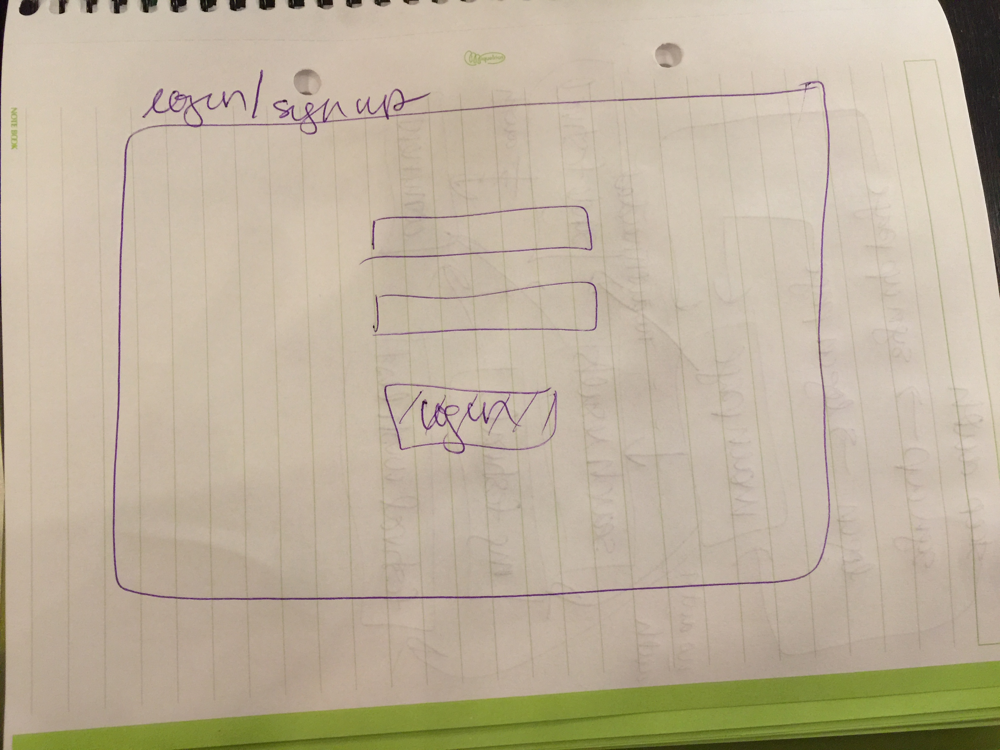
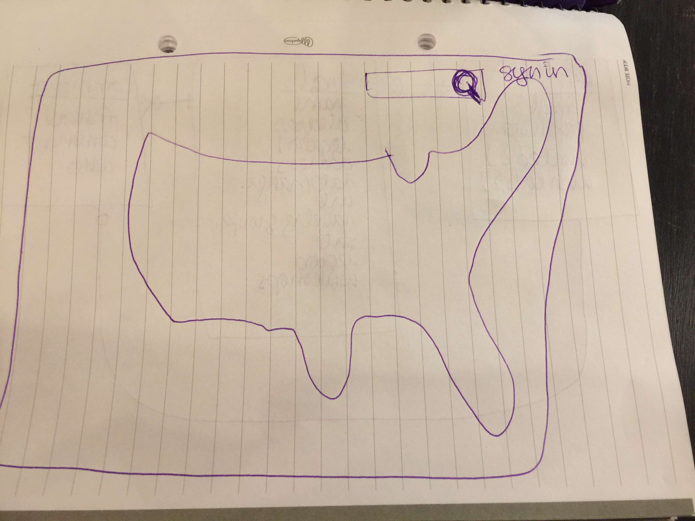
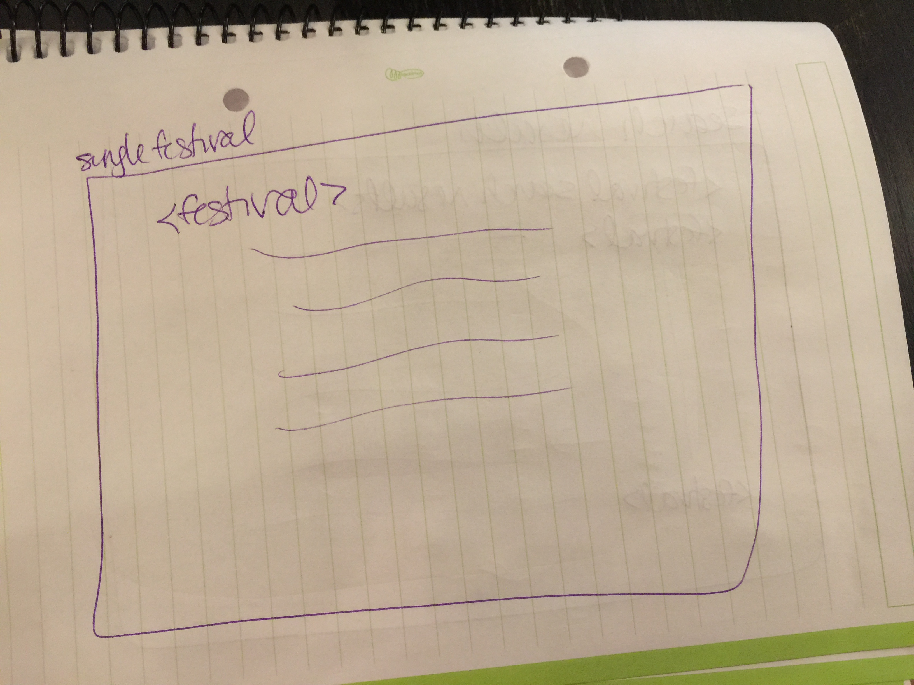
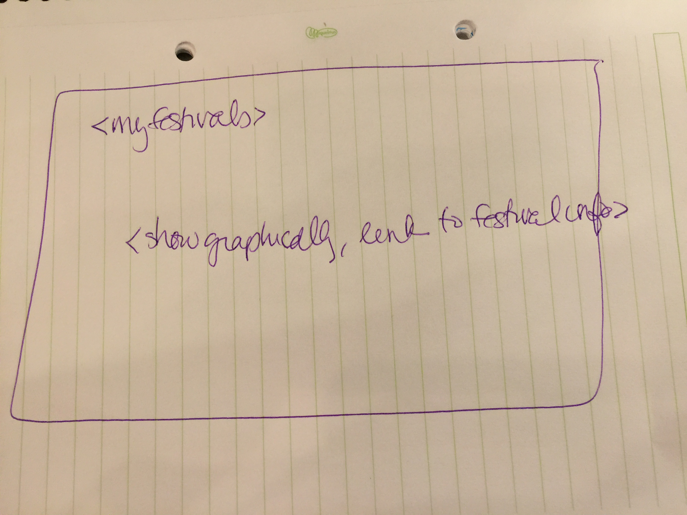
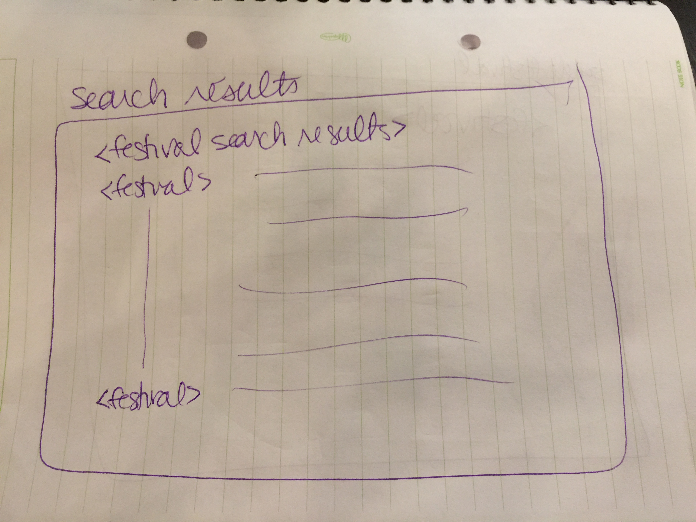
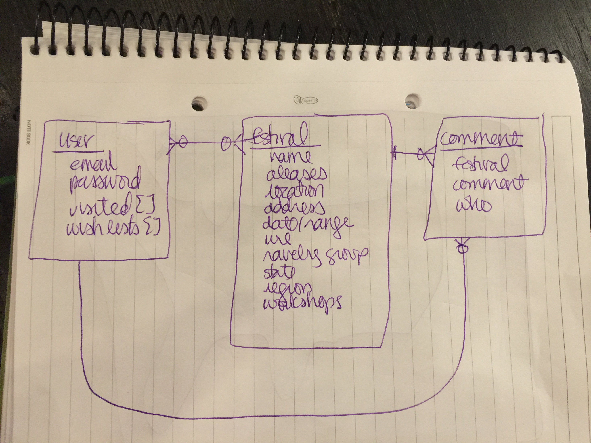

# WoolyWatch

## Overview

INCLUDE SCREENSHOT OF THE APP HERE!!!

WoolyWatch is an app that lists all known wool festivals in the US, and keeps track of which festivals you've visited. The entire list of festivals is available without logging in.

New festivals can be added; existing festivals can be edited and deleted, as needed.

If you create an account, you can save festivals you've visited, find festivals by state/region.

## Wireframes

## Stretch Goals

Future additions:
* show festival location with Google maps
* arrange meetups at the festivals
* link in breeds api from Stashy
* animal shows (which: sheep, goats, alpaca, llama, etc.)
* nearest airport
* wishlist
* reviews/attendee advice
* link to Stashy

## Development Notes

[Trello board](https://trello.com/b/z4T0eaGs/woolywatch)

Axios caches data by default, which is nice enough, but I haven't figured out, yet,  how to override that default so I can sort festival data by region, state.

## Installation

### Heroku

### Local Install

## Technology

* React 
* Bootstrap
* Axios
* Mongo so i can merge with stashy!
* I might use that JavaScript thing, too

## Wool Festival API Info

GET /api for wool festival API documentation

